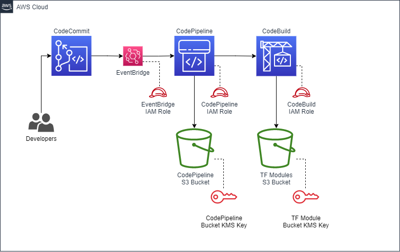

# Terraform Custom Module Pipeline

## Description

This Terraform stack will provision an S3 bucket, CodeCommit repository and CodePipeline pipeline. The CodeCommit repository can be used to develop custom modules. When merging to the `main` branch, CodePipeline will pull the source code from the CodeCommit repository, execute scans and linting tools, and then publish it into our S3 bucket.

----

## Architecture

----

## Pipeline Deployment

- Pull down source code to your local workstation
- Edit the `terraform.tfvars` file by setting values specific to your environment
- Ensure your CLI session is able to connect and authenticate to your target AWS account
- Initialize the Terraform project by running `terraform init`
- Plan and validate the project is ready to be deployed by running `terraform plan` and reviewing the output for errors
- If you are ready and there are no errors, deploy the project by running `terraform apply` and entering `yes` when prompted

----

## Pipeline Usage

- Log in to the AWS Console, visit the CodeCommit Console and search for the newly create repository
- Capture the Checkout path to your clipboard and return to your text editor or command-line tool
- Perform a `git checkout {clone url}` and begin creating your custom Terraform Modules
- To publish your new modules to the S3 bucket, push/merge to the `main` branch

----

## Authors

Mike Lynch ([mlynch1985@gmail.com](mailto:mlynch1985@gmail.com))
